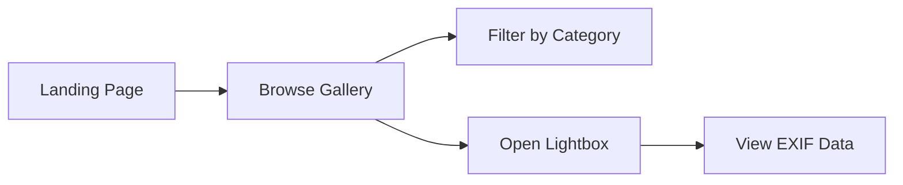

# **Software Requirements Specification (SRS)**  
 
**Project Name:** Professional Photography Portfolio  

---

## **1. Introduction**  
### **1.1 Purpose**  
To develop a modern, high-performance web gallery showcasing photographic work with:  
- Advanced image presentation  
- EXIF data visibility  
- Seamless user experience  

### **1.2 Target Audience**  
- Potential clients  
- Art directors  
- Photography enthusiasts  

### **1.3 Technical Stack**  
| Component | Technology |  
|-----------|------------|  
| Frontend  | HTML5, CSS3, JavaScript (ES6+) |  
| Image Processing | WebP conversion, Lazy Loading |  
| Hosting   | GitHub Pages / Netlify |  

---

## **2. Functional Requirements**  
### **2.1 Core Features**  
| ID | Feature | Description |  
|----|---------|-------------|  
| FR1 | Responsive Gallery Grid | Masonry-style layout adapting to all screen sizes |  
| FR2 | Advanced Lightbox | Full-screen viewer with navigation controls |  
| FR3 | EXIF Data Display | Shows camera metadata on image click |  
| FR4 | Category Filtering | Tag-based image filtering (Nature/Portrait/Urban) |  

### **2.2 User Interaction Flow**  


---

## **3. Technical Specifications**  
### **3.1 File Structure**  
```bash  
📦 src/  
├── 📂 assets/  
│   ├── 📂 images/          # Original photos (sorted by category)  
│   ├── 📂 js/  
│   │   ├── lightbox.js     # Lightbox controller  
│   │   ├── exif.js         # EXIF data handler  
│   │   └── main.js         # Core functionality  
│   └── 📂 css/  
│       ├── themes/         # Dark/light mode  
│       └── main.css        # Base styles  
├── 📄 index.html           # Main entry point  
└── 📄 README.md            # Deployment guide  
```  

### **3.2 Performance Metrics**  
| Metric | Target |  
|--------|--------|  
| Image Load Time | <1s (WebP format) |  
| Time to Interactive | <2s |  
| Lighthouse Score | ≥90/100 |  

---

## **4. UI/UX Requirements**  
### **4.1 Design System**  
- **Color Palette**: Dark-optimized for photo focus (#111 background)  
- **Typography**: Modern sans-serif (Inter or Helvetica Neue)  
- **Animations**:  
  - Smooth zoom transitions (300ms ease-out)  
  - Staggered card entrances  

### **4.2 Responsive Breakpoints**  
| Device | Width | Behavior |  
|--------|-------|----------|  
| Mobile | <768px | 1-column grid |  
| Tablet | 768-1024px | 2-column grid |  
| Desktop | ≥1024px | 3-column masonry |  

---

## **5. Project Roadmap**  
### **Phase 1: Core Gallery (Week 1-2)**  
- Implement base grid layout  
- Develop lightbox functionality  

### **Phase 2: Enhanced Features (Week 3-4)**  
- EXIF data integration  
- Category filtering system  

### **Phase 3: Optimization (Week 5)**  
- Lazy loading implementation  
- Accessibility audits  

---

## **6. Quality Assurance**  
### **6.1 Testing Matrix**  
| Test Type | Tools | Coverage |  
|-----------|-------|----------|  
| Cross-Browser | BrowserStack | Chrome/Firefox/Safari |  
| Performance | Lighthouse | All pages |  
| Accessibility | axe DevTools | WCAG 2.1 AA |  

